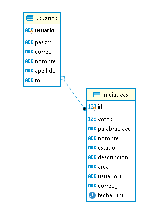

# PROTEAM
Proyecto final del curso CVDS (Ciclos de Vida y Desarrollo de Software)
### Integrantes:

* Cesar Eduard Gonzalez Cuentas

* Eduard Alexis Jimenez Sanchez

* Andres Jose Guiterrez Marin

* Jhonatan Camilo Pulido Ramirez

### Modelo Entidad Relación:
